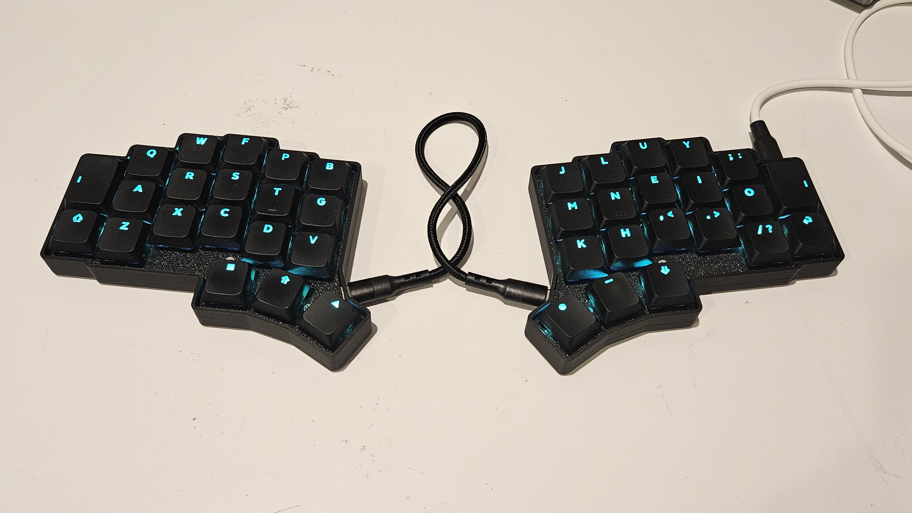
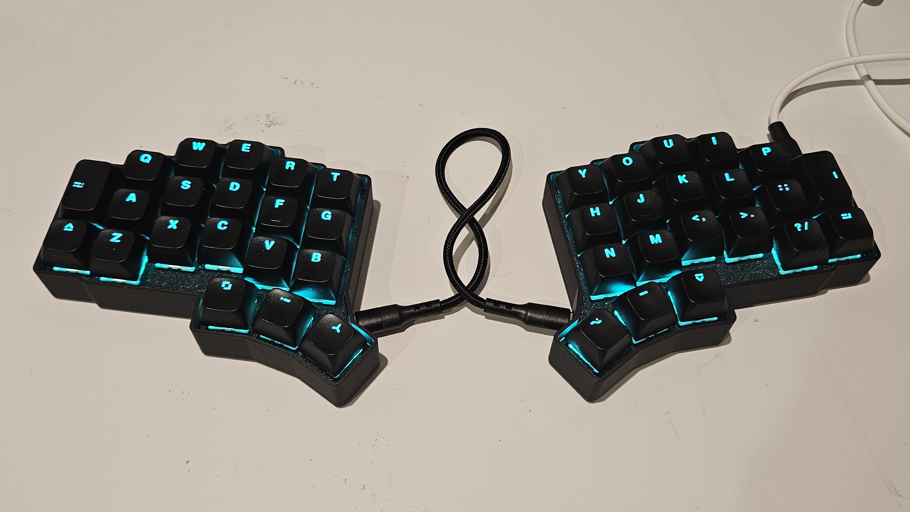

# Alpha Centauri KBD

This is a custom keyboard with a custom keymap that is specifically tailored to my hands and workflow style. It takes heavy inspiration from [crkbd v3](https://github.com/foostan/crkbd). The primary difference is the vertical spacing of the keys, and I have also removed one key from the outside column. The PCB is designed to support either MX or Choc v2 switches without sacrificing LED support. The keymap has been designed for comfort and efficiency, prioritizing typing/programming over other activities such as gaming.

### Assembled Choc Keyboard

### Assembled MX Keyboard

## Detailed Documentation

- [Quickstart](https://github.com/jacob-w-gable/alpha_centauri/wiki/Quickstart)
- [Designing/Fabricating the PCB](https://github.com/jacob-w-gable/alpha_centauri/wiki/Designing-and-Fabricating-PCB)
- TODO: PCB Assembly
- [Building/Flashing the Firmware](https://github.com/jacob-w-gable/alpha_centauri/wiki/Building-and-Flashing-Firmware)
- TODO: Printing the Case
- TODO: Final Assembly
- [Technical Layer Reference](https://github.com/jacob-w-gable/alpha_centauri/wiki/Technical-Layer-Reference)
- [Design Philosophy](https://github.com/jacob-w-gable/alpha_centauri/wiki/Design)
