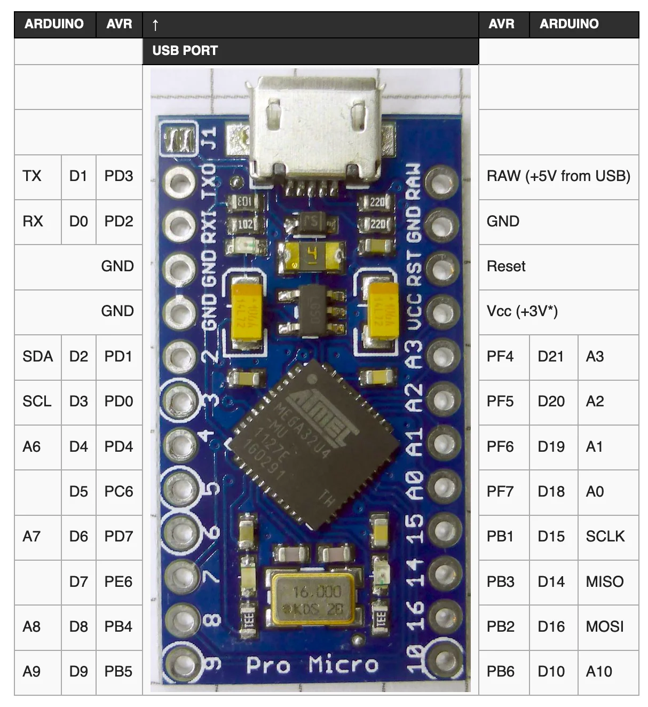

# Building and flashing the firmware

This documentation describes in detail how to build and flash the firmware. It assumes you are using Ubuntu.

## Prerequisites

Install `python3-pip`:

```bash
sudo apt install -y python3-pip
```

Install qmk:

```bash
python3 -m pip install --user qmk
```

Run qmk setup:

```bash
qmk setup
```

Now, you can test the environment by building a firmware. For example:

```bash
qmk compile -kb crkbd/rev1 -km default
```

## Configure environment

Set the default keyboard and keymap. Technically this is optional, but otherwise you will need to pass the `-kb` and `-km` flags to every `qmk` command.

```bash
qmk config user.keyboard=alpha_centauri
qmk config user.keymap=default
```

Clone this repository:

```bash
git clone git@github.com:jacob-w-gable/alpha_centauri.git
```

Create a symlink into your QMK directory:

```bash
ln -s ~/Projects/alpha_centauri ~/qmk_firmware/keyboards/alpha-centauri
```

Now you can `cd` into the keymap directory, and you are ready to build the firmware.

## Building the firmware

Building the firmware should be as simple as running `make` or `make compile`.

That being said, breaking changes are introduced into QMK frequently. If you encounter issues, the last commit that this firmware has been tested on is [`884a808`](https://github.com/qmk/qmk_firmware/commit/884a808813fe9e5f90aab4079a5944997465161e).

## Flashing the firmware

Lastly, if you know that everything builds correctly, you can flash the firmware using `make flash`. This will build unique firmware for each side of the keyboard, and it will automatically flash both sides. First the left, then the right. By default, it assumes you are using Elite-Pi microcontrollers.

This can be done while actively using the keyboard you're developing for. While the left-side firmware is building, put the left keyboard into flash mode by pressing the reset button twice (assuming rp2040 - this means shorting RUN with GND). The firmware will automatically flash itself. Then, while the right-side firmware is building, unplug the left side, plug in the right side, and put the right keyboard into flash mode by pressing the reset button twice. Finally, wait for the right side to flash itself.

If the keyboard is not automatically detected, you will need to pull out a second keyboard to manually mount it. You will be able to see the device listed in `lsblk`, as `/dev/sdX`, if it's in flash mode. rp2040's will have one single partition, called `/dev/sdX1`, that is 128M. Once you have identified the correct value of `X`, you can mount the device with

```bash
udiskctl mount -b /dev/sdX1
```

The qmk flasher will now auto-detect the device and flash the firmware.

## Important notes

1. In terms of pinouts, one difference between this keyboard and CRKBD is the split serial pin. On the CRKBD, this is `D2`, but on this keyboard it is `B5`. This is an difference to note when assembling the hardware. This difference will likely be corrected in the future.
2. The QMK pinouts are weird. They reference the AVR microcontroller pinouts, rather than the breakout board pinouts, which likely don't match. It's hard to find this mapping documented anywhre, so here is an image for future reference:



