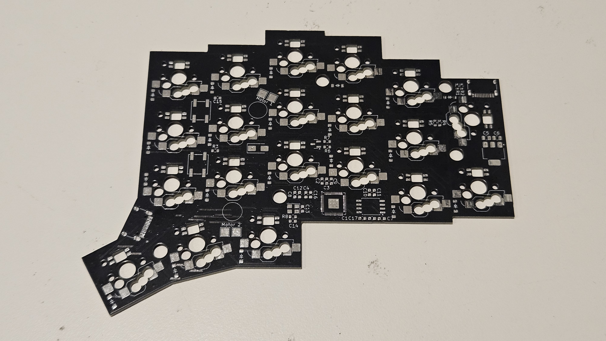
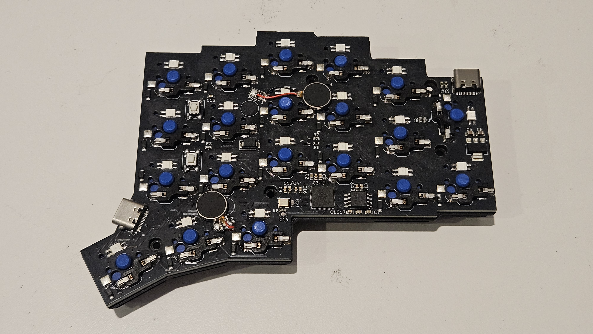

# PCB Files

These are the files required to edit the PCB in Kicad. One thing that makes this PCB stand out, is the fact that you can use hotswap sockets for either MX or Choc style switches, without compromising the ability to use per-key LEDs. While this does unfortunately cut off one of the pads, it does not make an electrical difference.

