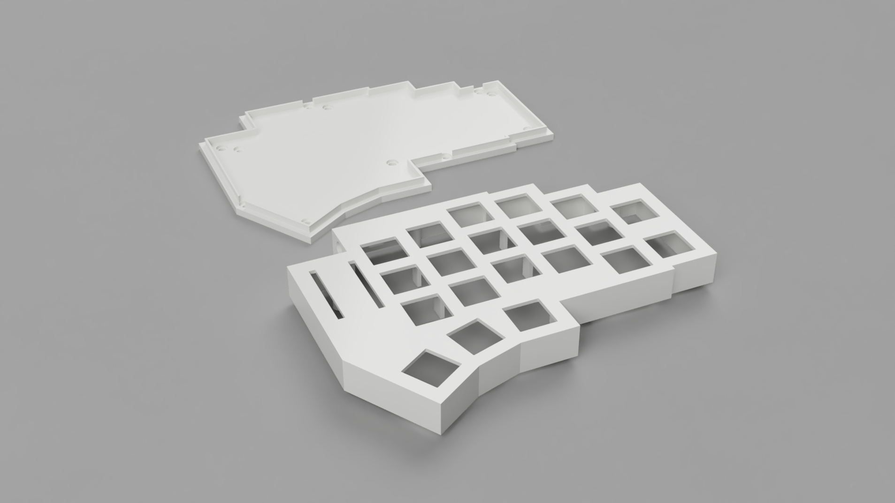

# STL files

These are the files for 3D-printing the keyboard case. These cases are compatible with Amoeba v1 or Amoeba King PCB's. Amoeba Royale's are not supported. The primary difference between the two versions is the structural supports in the middle of the keyboard, which Amoeba Royale's do not provide enough room for. The other difference is that the case for Amoeba King's is slightly larger, to compensate for the slightly larger PCB's. 

Of course, the advantage of Amoeba King's over Amoeba v1's, is support for per-key LED backlighting. 

If you simply want to handwire, either case will do, though the King case will use _slightly_ more material. 



## Printing

No special instructions, considering no supports are necessary. But for consistency, here are some parameters I used:

* Material: PLA
* Layer Height: 0.12mm
* Infill: 15%
* Nozzle Size: 0.4mm

## Firmware Differences

You may find a slight difference in the diode direction, depending on which PCB you are using. For me personally, my King's required

```
  "diode_direction": "ROW2COL",
```

while my v1's required

```
  "diode_direction": "COL2ROW",
```

The direction is ROW2COL by default, so take note of this difference if you want to use Amoeba v1's.
